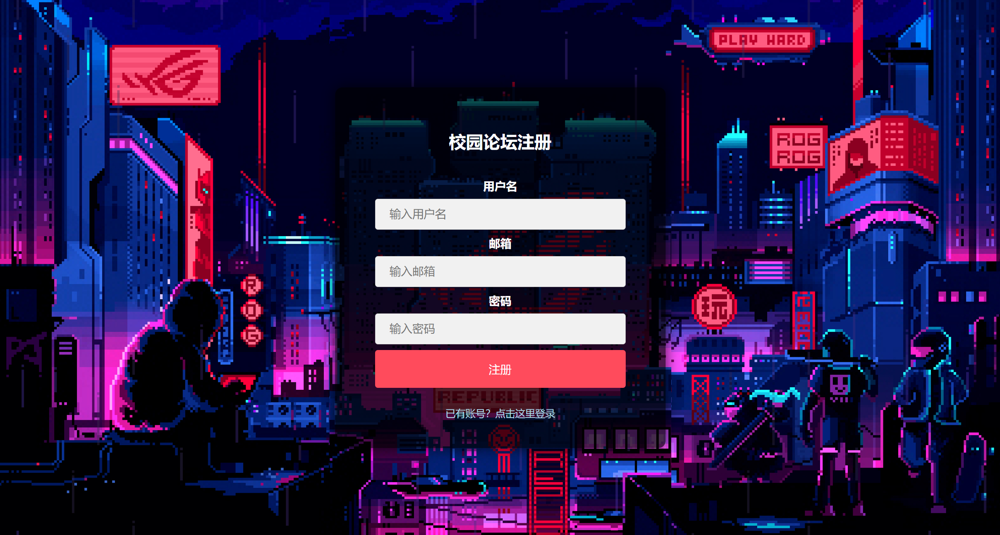
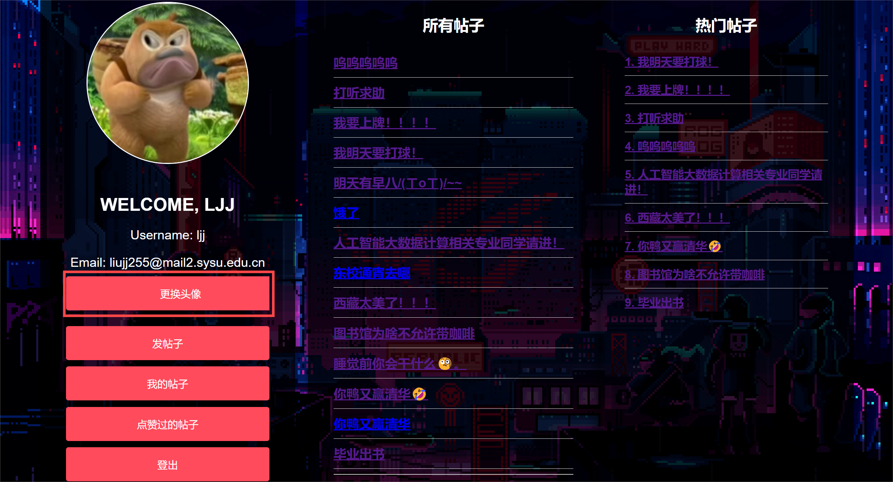

# 软件工程课程设计功能描述文档
## 一、课程设计介绍
课程设计的校园论坛平台提供了用户注册与登录、个人信息管理、帖子发布与管理、互动浏览、以及管理员管理等功能:
- 用户可以注册并登录平台，修改头像，发布和管理自己的帖子，浏览和评论所有帖子，点赞或取消点赞，并查看自己点赞的帖子。
- 平台首页有热帖排行榜，展示当前最受欢迎的帖子。
- 管理员能够浏览和删除所有帖子，维护论坛秩序，确保内容健康。

## 二、课程设计功能说明
### 校园论坛平台功能概述

校园论坛平台提供了用户注册与登录、个人信息管理、帖子发布与管理、互动浏览、以及管理员管理等功能。具体功能点如下：

- 用户注册
- 用户登录平台
- 用户退出登录
- 修改头像
- 发布帖子
- 删除自己的帖子
- 浏览所有帖子
- 评论帖子
- 点赞帖子
- 取消点赞
- 查看自己点赞的帖子
- 平台首页展示热帖排行榜
- 管理员浏览所有帖子
- 管理员删除帖子

### 1. 用户注册与登录

- **用户注册**：用户可以通过手机号或邮箱进行注册，填写必要的个人信息(如用户名、密码、邮箱等)。

- **用户登录**：注册用户可以通过用户名和密码登录平台。
  

- **登录成功后进入主界面**:用户输入用户名、密码正确后,登陆成功,进入用户主界面。

- **退出登录**：用户可点击左下角的登出按钮，实现随时退出登录，保障账号安全。

### 2. 用户个人信息管理

- **修改头像**：用户可以上传和修改自己的头像，展示个性化形象。

用户可以点击**更换头像**来修改自己的头像。

用户可以选择**本地图片**来修改头像。

可以看到用户修改头像成功。

- **查看个人帖子**：用户可以查看自己发布的所有帖子，并进行管理。

用户可以点击**我的帖子**查看自己发布的所有帖子。

点击后,用户可以看到自己发布的所有帖子。

点击帖子标题,可以查看帖子内容

### 3. 帖子管理
- **发布帖子**：用户可以在论坛上发布帖子，分享信息、讨论话题等。
- **删除帖子**：用户可以删除自己发布的帖子。

### 4. 浏览与互动
- **浏览帖子**：用户可以浏览平台上所有的帖子，根据自己的兴趣选择阅读。
- **热帖排行榜**：主页展示当前平台上的热门帖子，按点赞数、评论数等排序。
- **点赞与取消点赞**：用户可以点赞自己喜欢的帖子，也可以取消点赞。
- **查看自己点赞的帖子**：用户可以查看自己点赞过的所有帖子，方便回顾。
- **评论**：用户可以在帖子下面发表评论，与其他用户进行交流和互动。

### 5. 管理员功能
目前设置的管理员用户名为
- **浏览所有帖子**：管理员可以查看平台上所有的帖子，了解用户的发帖情况。
- **删除帖子**：管理员可以删除不符合平台规定的帖子，维护论坛秩序。

通过上述功能，校园论坛平台可以为用户提供一个方便的交流互动空间，并通过管理员的管理，确保平台内容健康有序。
## 三、课程设计操作说明